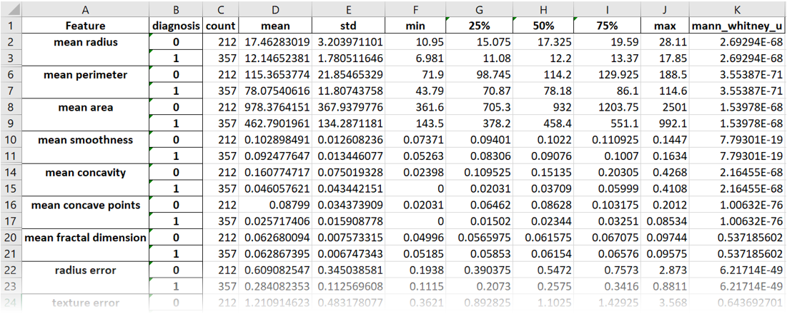
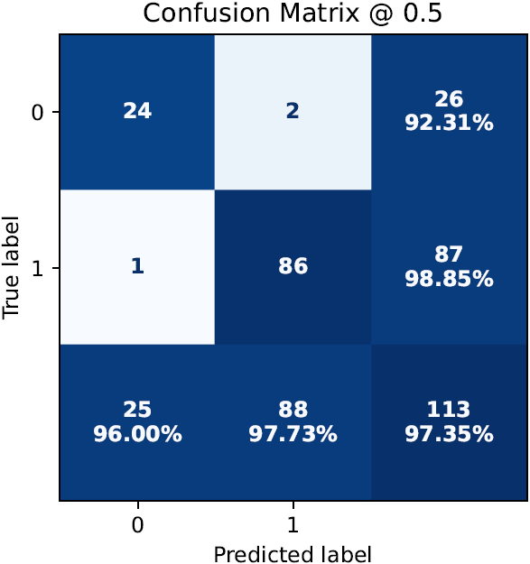
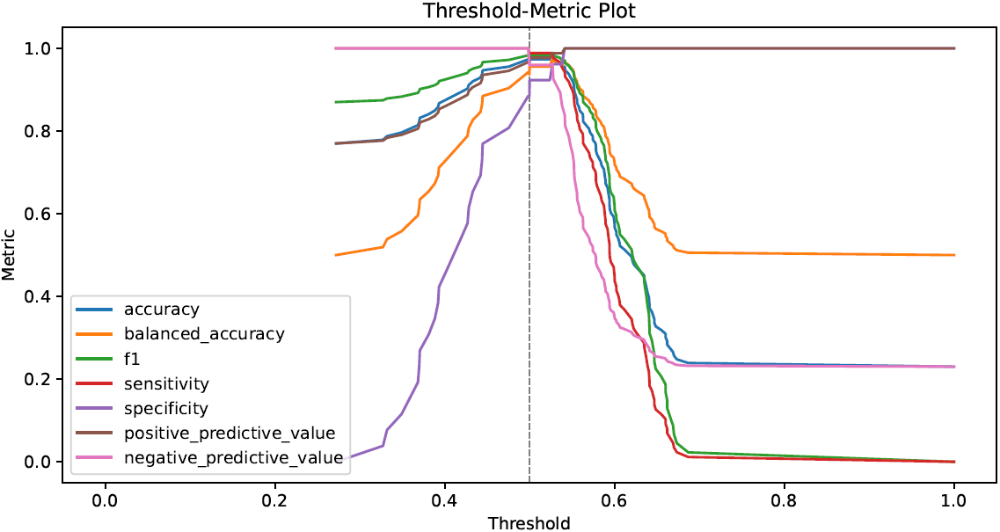
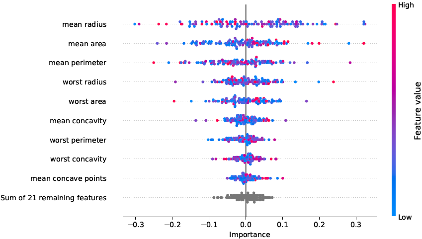

# CaTabRa

<p align="center">
  <a href="#About"><b>About</b></a> &bull;
  <a href="#Quickstart"><b>Quickstart</b></a> &bull;
  <a href="#Examples"><b>Examples</b></a> &bull;
  <a href="#Documentation"><b>Documentation</b></a> &bull;
  <a href="#References"><b>References</b></a> &bull;
  <a href="#Contact"><b>Contact</b></a> &bull;
  <a href="#Acknowledgments"><b>Acknowledgments</b></a>
</p>

<div align="center">
  
</div>

[]()

## About

**CaTabRa** is a Python package for analyzing tabular data in a largely automated way. This includes generating
descriptive statistics, creating out-of-distribution detectors, training prediction models for classification and
regression tasks, and evaluating/explaining/applying these models on unseen data.

CaTabRa is both a command-line tool and a library, which means it can be easily integrated into other projects.

## Quickstart

### Installation

**TODO**: Proper installation guide with pip.

Install the relevant packages, as listed in `env.yml` and `requirements.txt`, in a new or existing environment. The
basic requirements are Python 3.9, [pandas](https://pandas.pydata.org/),
[auto-sklearn](https://automl.github.io/auto-sklearn/master/) and [shap](https://github.com/slundberg/shap).

**IMPORTANT**: CaTabRa currently only runs on Linux, because
[auto-sklearn only runs on Linux](https://automl.github.io/auto-sklearn/master/installation.html). If on Windows,
you can use a virtual machine, like [WSL 2](https://docs.microsoft.com/en-us/windows/wsl/about), and install CaTabRa
there. If you want to use Jupyter, install Jupyter on the virtual machine as well and launch it with the `--no-browser`
flag.

### Usage Mode 1: Command-Line

```shell
$ python -m catabra analyze breast_cancer.csv --classify diagnosis --split train --out breast_cancer_result
```
This command analyzes `breast_cancer.csv` and trains a prediction model for classifying the samples according to column
`"diagnosis"`. Column `"train"` is used for splitting the data into a train- and a test set, which means that the final
model is automatically evaluated on the test set after training. All results are saved in directory `breast_cancer_out`.

```shell
$ python -m catabra explain breast_cancer_result --on breast_cancer.csv --out breast_cancer_explanation
```
This command explains the classifier trained in the previous command by computing SHAP feature importance scores for
every sample. The results are saved in directory `breast_cancer_explanation`.

### Usage Mode 2: Python

The two commands above translate to the following Python code:
```python
from catabra.analysis import analyze
from catabra.explanation import explain

analyze("breast_cancer.csv", classify="diagnosis", split="train", out="breast_cancer_result")
explain("breast_cancer.csv", "breast_cancer_result", out="breast_cancer_explanation")
```

### Results

Invoking the two commands generates a bunch of results, most notably

* the trained classifier
* descriptive statistics of the underlying data<br>
  
* performance metrics in tabular and graphical form<br>
  
  
* feature importance scores in tabular and graphical form<br>
  
* ... and many more.

## Examples

### Basic Examples

* **[Binary-Classification.ipynb](https://github.com/risc-mi/catabra/examples/Binary-Classification.ipynb)**
  * Analyze data with a binary target
  * Train a high-quality classifier with automatic model selection and hyperparameter tuning
  * Investigate the final classifier and the training history
  * Calibrate the classifier on dedicated calibration data
  * Evaluate the classifier on held-out test data
  * Explain the classifier by computing SHAP feature importance scores
* **[Multiclass-Classification.ipynb](https://github.com/risc-mi/catabra/examples/Multiclass-Classification.ipynb)**
* **[Multilabel-Classification.ipynb](https://github.com/risc-mi/catabra/examples/Multilabel-Classification.ipynb)**
* **[Regression.ipynb](https://github.com/risc-mi/catabra/examples/Regression.ipynb)**

### Configuration

* Performance metrics
  * Change hyperparameter optimization objective
  * Specify metrics to calculate during model training
* Time- and memory budget and parallel jobs
  * Adjust the time- and memory budget for hyperparameter tuning
  * Specify the number of parallel jobs
* Bootstrapping
  * Compute bootstrapped performance metrics
* Out-of-Distribution (OOD) detection
  * Configure OOD detection
* Plotting
  * Create interactive plots
* auto-sklearn specific configuration
  * Restrict model classes and preprocessing steps
  * Specify resampling strategies for internal validation

### Data Preparation

* Longitudinal data
  * Transform longitudinal (i.e., time-series-like) data into "samples x features" format
  * Extract features with frameworks like [tsfresh](https://github.com/blue-yonder/tsfresh)

### Extending CaTabRa

* AutoML
  * Add new AutoML backend
* Explanation
  * Add new explanation backend
* OOD-detector
  * Add new OOD detection backend

## Documentation

Directory `/doc` documents a couple of specific aspects of CaTabRa, like its command-line interface, available
performance metrics, built-in OOD-detectors and model explanation details.

**TODO**: API documentation, e.g. sphinx

## References

A conference paper describing CaTabRa is currently in preparation.

## Contact

If you have any inquiries, please open a GitHub issue.

## Acknowledgments

This project is financed by research subsidies granted bythe government of Upper Austria. RISC Software GmbH is Member
of UAR (Upper Austrian Research) Innovation Network.