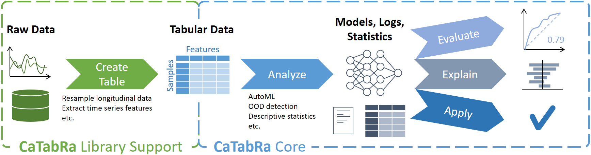

# CaTabRa

<p align="center">
  <a href="#About"><b>About</b></a> &bull;
  <a href="#Quickstart"><b>Quickstart</b></a> &bull;
  <a href="#Examples"><b>Examples</b></a> &bull;
  <a href="#Documentation"><b>Documentation</b></a> &bull;
  <a href="#References"><b>References</b></a> &bull;
  <a href="#Contact"><b>Contact</b></a> &bull;
  <a href="#Acknowledgments"><b>Acknowledgments</b></a>
</p>

<div align="center">
  
</div>

[]()

## About

**CaTabRa** is a Python package for analyzing tabular data in a largely automated way. This includes generating
descriptive statistics, creating out-of-distribution detectors, training prediction models for classification and
regression tasks, and evaluating/explaining/applying these models on unseen data.

CaTabRa is both a command-line tool and a library, which means it can be easily integrated into other projects.

## Quickstart

### Installation

Clone the repository and install the package with [Poetry](https://python-poetry.org/docs/).
Set up a new Python environment with Python >=3.9 (e.g. using
[conda](https://docs.conda.io/projects/conda/en/latest/user-guide/tasks/manage-environments.html#creating-an-environment-with-commands)),
activate it, and then run

```shell
git clone https://github.com/risc-mi/catabra.git
cd catabra
poetry install
```

The project is installed in editable mode by default. This is useful if you plan to make changes to CaTabRa's code.

**IMPORTANT**: CaTabRa currently only runs on Linux, because
[auto-sklearn only runs on Linux](https://automl.github.io/auto-sklearn/master/installation.html). If on Windows,
you can use a virtual machine, like [WSL 2](https://docs.microsoft.com/en-us/windows/wsl/about), and install CaTabRa
there. If you want to use Jupyter, install Jupyter on the virtual machine as well and launch it with the `--no-browser`
flag.

### Usage Mode 1: Command-Line

```shell
python -m catabra analyze example_data/breast_cancer.csv --classify diagnosis --split train --out breast_cancer_result
```

This command analyzes `breast_cancer.csv` and trains a prediction model for classifying the samples according to column
`"diagnosis"`. Column `"train"` is used for splitting the data into a train- and a test set, which means that the final
model is automatically evaluated on the test set after training. All results are saved in directory `breast_cancer_out`.

```shell
python -m catabra explain breast_cancer_result --on example_data/breast_cancer.csv --out breast_cancer_result/expl
```

This command explains the classifier trained in the previous command by computing SHAP feature importance scores for
every sample. The results are saved in directory `breast_cancer_result/expl`. Depending on the type of the trained
models, this command may take several minutes to complete.

### Usage Mode 2: Python

The two commands above translate to the following Python code:

```python
from catabra.analysis import analyze
from catabra.explanation import explain

analyze("example_data/breast_cancer.csv", classify="diagnosis", split="train", out="breast_cancer_result")
explain("example_data/breast_cancer.csv", "breast_cancer_result", out="breast_cancer_result/expl")
```

### Results

Invoking the two commands generates a bunch of results, most notably

* the trained classifier
* descriptive statistics of the underlying data<br>
  
* performance metrics in tabular and graphical form<br>
  
  
* feature importance scores in tabular and graphical form<br>
  
* ... and many more.

## Examples

### Walk-Through Tutorials

* **[Workflow.ipynb](https://github.com/risc-mi/catabra/tree/main/examples/Workflow.ipynb)**
  * Analyze data with a binary target
  * Train a high-quality classifier with automatic model selection and hyperparameter tuning
  * Investigate the final classifier and the training history
  * Calibrate the classifier on dedicated calibration data
  * Evaluate the classifier on held-out test data
  * Explain the classifier by computing SHAP- and permutation importance scores
  * Apply the classifier to new samples
* **[Longitudinal.ipynb](https://github.com/risc-mi/catabra/tree/main/examples/Longitudinal.ipynb)**
  * Process longitudinal data by resampling into "samples x features" format

### Short Examples

* **[Prediction-Tasks.ipynb](https://github.com/risc-mi/catabra/tree/main/examples/Prediction-Tasks.ipynb)**
  * Binary classification
  * Multiclass classification
  * Multilabel classification
  * Regression
* **[Performance-Metrics.ipynb](https://github.com/risc-mi/catabra/tree/main/examples/Performance-Metrics.ipynb)**
  * Change hyperparameter optimization objective
  * Specify metrics to calculate during model training
* **[Plotting.ipynb](https://github.com/risc-mi/catabra/tree/main/examples/Plotting.ipynb)**
  * Create plots in Python
  * Create interactive plots
* **[AutoML-Config.ipynb](https://github.com/risc-mi/catabra/tree/main/examples/AutoML-Config.ipynb)**
  * General configuration
    * Ensemble size
    * Time- and Memory budget
    * Number of parallel jobs
  * Auto-Sklearn-specific configuration
    * Model classes and preprocessing steps
    * Resampling strategies for internal validation
    * Grouped splitting
* **[Fixed-Pipeline.ipynb](https://github.com/risc-mi/catabra/tree/main/examples/Fixed-Pipeline.ipynb)**
  * Specify fixed ML pipeline (no automatic hyperparameter optimization)
  * Manually configure hyperparameters
  * Suitable for creating baseline models

### Extending CaTabRa

* **[AutoML-Extension.ipynb](https://github.com/risc-mi/catabra/tree/main/examples/AutoML-Extension.ipynb)**
  * Add new AutoML backend
* **[Explanation-Extension.ipynb](https://github.com/risc-mi/catabra/tree/main/examples/Explanation-Extension.ipynb)**
  * Add new explanation backend
* **[OOD-Extension.ipynb](https://github.com/risc-mi/catabra/tree/main/examples/OOD-Extension.ipynb)**
  * Add new OOD detection backend

## Documentation

Directory [doc/](https://github.com/risc-mi/catabra/tree/main/doc/md) documents a couple of specific aspects of CaTabRa,
like its  command-line interface, available performance metrics, built-in OOD-detectors and model explanation details.

Detailed API documentation is currently in preparation.

## References

A conference paper describing CaTabRa is currently in preparation.

## Contact

If you have any inquiries, please open a GitHub issue.

## Acknowledgments

This project is financed by research subsidies granted by the government of Upper Austria. RISC Software GmbH is Member
of UAR (Upper Austrian Research) Innovation Network.