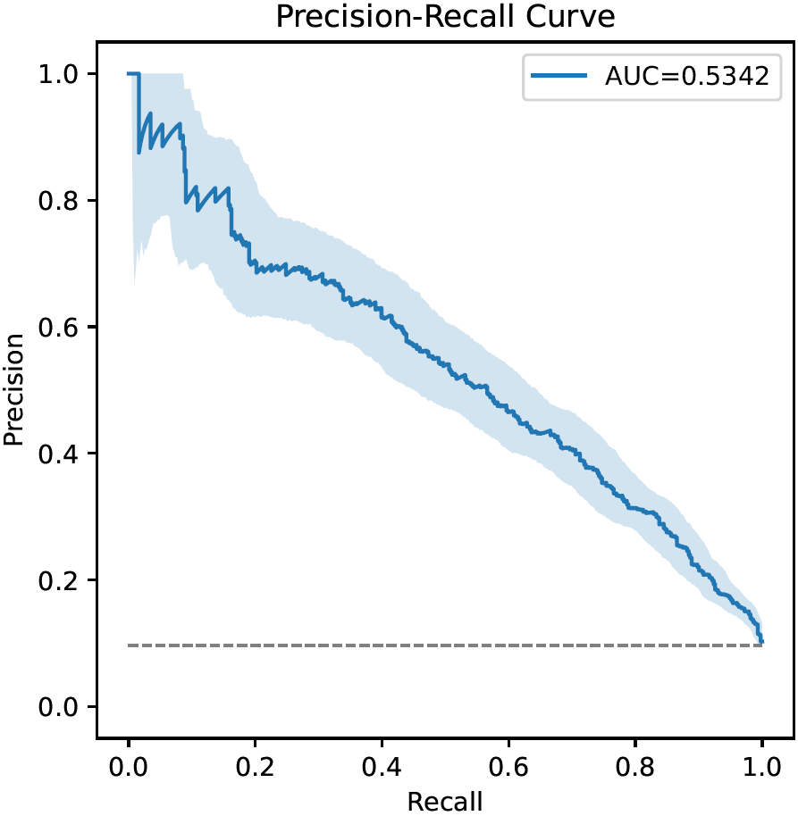

# Plots

## Plot Types

This section lists all plot types that are currently supported by CaTabRa and automatically created when generating,
evaluating or explaining prediction models. For each plot type, both [Matplotlib](https://matplotlib.org/) and
[plotly](https://plotly.com/python/) based implementations exist: Matplotlib is used for creating static plots, plotly
for creating interactive plots.

**Note**: plotly is *not* installed by default. Before using it, it must be installed manually using either `pip` or
`conda`:
```
$ pip install plotly==5.7.0
```
or
```
$ conda install plotly=5.7.0 -c plotly
```

### Training History

Training history plots visualize the evolution of model performance during training as line charts. They display:
* the main metric used for model selection on the internal training set (prefix `"train_"`),
* all configured performance metrics on the internal validation set(s) (prefix `"val_"`), and
* the value of the main metric achieved by the entire ensemble on the validation set(s) (prefix `"ensemble_val_"`).


The x-axis corresponds to the training time, the y-axis to the metric values. Note that the y-axis may be scaled
logarithmically if necessary.

The performance of models trained later can be worse than the performance of models trained earlier, meaning that the
lines in the plot can in principle oscillate arbitrarily. The only exception to this rule is typically the line
corresponding the entire ensemble of models, as new models are normally only added to it if they improve performance.

### Truth-Prediction Plot (Regression)

Truth-prediction plots visualize the relationship between ground truth and model predictions in regression problems as
scatter plots.


The x-axis corresponds to the true labels, the y-axis to the predicted labels, and each dot corresponds to one sample.
If the prediction model worked perfectly, all dots would lie on the main diagonal (gray dashed line).

### Receiver Operating Characteristic Curve (Binary- and Multilabel Classification)

[Receiver operating characteristic curves](https://en.wikipedia.org/wiki/Receiver_operating_characteristic) (ROC-curves)
visualize the diagnostic ability of binary classifiers as their decision thresholds vary. They are similar to
precision-recall curves.


The x-axis corresponds to the false positive rate at each decision threshold (equivalent to 1-specificity), the y-axis
to the corresponding true positive rate. Every curve starts in (0,0) (classifier always predicts negative class) and
ends in (1,1) (classifier always predicts positive class). The gray dashed line illustrates a random classifier; the
further above the gray line the ROC curve stays, the better.

The area under the curve (AUC), an important performance metric in binary classification problems, is also shown.
Furthermore, the bootstrapped 95% confidence interval around the ROC-curve is drawn if bootstrapping is enabled.

### Precision-Recall Curve (Binary- and Multilabel Classification)

Precision-recall curves (PR-curves) visualize the diagnostic ability of binary classifiers as their decision
thresholds vary. They are similar to receiver operating characteristic curves.



The x-axis corresponds to the recall at each decision threshold (a.k.a. true positive rate, sensitivity),
the y-axis to the corresponding precision (a.k.a. positive predictive value). Every curve starts in (0,1) (classifier
always predicts negative class) and ends in (1,*p*) (classifier always predicts positive class; *p* is the prevalence
of the positive class). The gray dashed line illustrates a random classifier; the further above the gray line the PR
curve stays, the better.

The area under the curve (AUC), an important performance metric in binary classification problems, is also shown.
Furthermore, the bootstrapped 95% confidence interval around the PR-curve is drawn if bootstrapping is enabled.

### Calibration Curve (Binary Classification)

Calibration curves visualize the relationship between the decision thresholds of binary classifiers and the
corresponding fraction of positive samples.


The x-axis corresponds to decision thresholds, the y-axis to the fraction of positive samples. Fractions of positive
samples are computed by partitioning the range of thresholds into bins and dividing the number of positive samples by
the total number of samples in each bin. The x-coordinates of the dots in the figure correspond to the midpoints of the
bins. Bin sizes are chosen such that each bin contains roughly the same number of samples, which is the reason why in
the figure above there are many more (smaller) bins on the left than on the right.

Ideally, the calibration curve should be strictly increasing from 0 to 1.

The bootstrapped 95% confidence interval around the calibration curve is drawn if bootstrapping is enabled.

### Threshold-Metric Plot (Binary- and Multilabel Classification)

Threshold-metric plots visualize the dependency of thresholded performance metrics on specific decision thresholds.


The x-axis corresponds to decision thresholds, the y-axis to values of performance metrics for binary classification
that lie between 0 (worst) and 1 (optimal). The gray dashed line visualizes the "standard" decision threshold at 0.5.

In the figure above, accuracy, balanced accuracy, sensitivity and specificity at approx. 0.17 are all equal to approx.
0.8, whereas at approx. 0.35 sensitivity, positive predictive value and the F1 score coincide with a value of approx.
0.5.

### Confusion Matrix (Binary- and Multiclass Classification)

[Confusion matrices](https://en.wikipedia.org/wiki/Confusion_matrix) visualize the total numbers of samples in each
combination of true and predicted class.


The x-axis corresponds to the predicted labels and the y-axis to the true labels. The top-left cell, therefore, displays
the number of correctly predicted samples belonging to the "first" class. In general, the cells on the diagonal
correspond to correct predictions, whereas all other cells correspond to misclassifications. Cells are colored depending
on the number they display; in the example above, white-ish cells contain only few samples, whereas dark blue-ish cells
contain many samples.

The last row and column contain row- and column-wise sums, respectively, with percentages of the correctly classified
samples in each row/column. The bottom-right cell, hence, shows the total number of samples together with the
(unbalanced) accuracy. These cells are colored independently of the numbers they contain.

In binary classification, the decision threshold underlying confusion matrices is by default set to 0.5.

### Beeswarm Plot (Local Explanations)

Beeswarm plots are an effective means to visualize local (i.e., sample-wise) model explanations given in terms of
feature importance scores.


On the left, individual features are listed, and for each feature one dot is draw for every sample. The x-coordinates
of the dots represent the importance of the respective feature for predicting the respective sample, and the color (if
any) corresponds to the feature value (small values are blue, large values are red; colors are chosen relatively to the
distribution of feature values in the set of samples that are being plotted). In high-density regions the dots spread
more along the y-axis than in low-density regions.

In the figure above, large values of feature "age" have a moderately positive impact on the model output, whereas small
values can make the model output significantly smaller. In contrast, large values of feature "lab_features__PH" have a
negative impact on the model output, and small values have a positive impact.

The styling of beeswarm plots in CaTabRa was largely inspired by the [shap package](https://github.com/slundberg/shap).

### Bar Plot (Global Explanations)

Bar plots complement beeswarm plots by visualizing global model explanations, given in terms of feature importance
scores.


For every feature there are one or two bars, depending on whether feature importance is split into positive and negative
contributions. In any case, the "absolute" importance of a feature is given by the total width of the bar(s), so in the
example above the most important feature is "trend_HR mean -1 days +23:00:00". It can also be seen that all features
have a stronger negative than positive impact on the model output.

The styling of bar plots in CaTabRa was largely inspired by the [shap package](https://github.com/slundberg/shap).

## Creating Plots from Raw Evaluation- or Explanation Results

By default, CaTabRa visualizes the results of model evaluations and explanations in a variety of static and/or
interactive plots that are automatically saved to disk. For more fine-grained control of what should be visualized,
and how it should be styled, there are simple mechanisms for reproducing and customizing any of the standard plots from
raw evaluation or explanation results.

### Training History

```python
from catabra import analysis
from catabra.util import plotting

# create plot, and return it in dict with single key "training_history"
plot = analysis.CaTabRaAnalysis.plot_training_history(
    "training_history.xlsx",
    interactive=...
)

# inspect and customize plot
# ...

# save plot
plotting.save(plot, "plot_dir")
```

### Performance Plots (Evaluations)

All that is required to reproduce performance plots, like confusion matrices, ROC- and PR-curves, or scatter plots, are
sample-wise predictions (as saved in `"predictions.xlsx"`), aggregate performance metrics (as saved in
`"metrics.xlsx"`), and the corresponding data encoder that can be easily obtained from a `CaTabRaLoader` object.
If you only have sample-wise predictions but no performance metrics, refer to `doc/metrics.md` for information on how
to create the latter.

```python
from catabra.util import io
from catabra.util import plotting
from catabra import evaluation

# create plots, and store them in dict whose values
# are Matplotlib or plotly figure objects
loader = io.CaTabRaLoader("CaTabRa_dir")
plots = evaluation.plot_results(
    "predictions.xlsx",
    "metrics.xlsx",
    loader.get_encoder(),
    interactive=...,
    bootstrapping_repetitions=...
)

# inspect and customize plots
# ...

# save plots
plotting.save(plots, "plot_dir")
```

### Explanations

```python
from catabra.util import plotting
from catabra import explanation

# create beeswarm plots of local explanations, and store them in dict
# whose values are Matplotlib or plotly figure objects
beeswarm_plots = explanation.plot_beeswarms(
    {"model_1": "1.h5", "model_2": "2.h5"},
    features=...,   # None or _encoded_ feature values; e.g. `encoder.transform(X)`
    interactive=...,
    max_features=...,
    add_sum_of_remaining=...
)

# create bar plots of global explanations, and store them in dict
# whose values are Matplotlib or plotly figure objects
bar_plots = explanation.plot_bars(
    {"model_1": "1.h5", "model_2": "2.h5"},
    interactive=...,
    max_features=...,
    add_sum_of_remaining=...
)

# save plots
plotting.save(beeswarm_plots, "plot_dir")
plotting.save(bar_plots, "plot_dir")
```

If you have local explanations, but still want to visualize their average global impact in a bar plot, you can use
function `average_local_explanations()`:

```python
from catabra import explanation

# get local explanations
local_explanations = ...

# convert them into global explanations
global_explanations = explanation.average_local_explanations(local_explanations)
```
